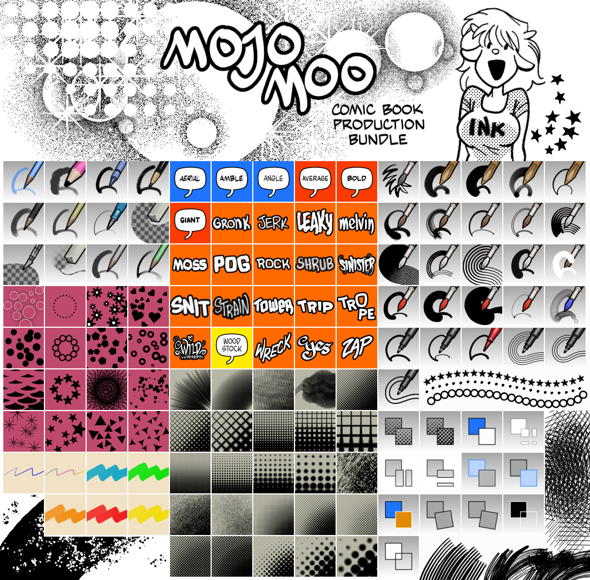
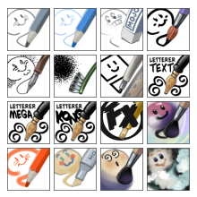
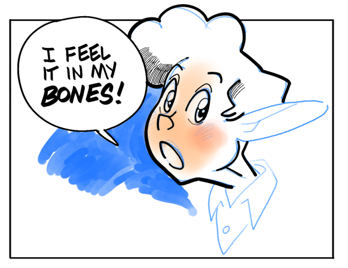

# Preset bundles for Krita and brushes for MyPaint

## Mojo Moo for Krita

⏬ [Click here for details and downloads](releases/tag/moo)

## Mojo for MyPaint

A set of brushes for making comics in MyPaint! Download the ZIP and then import it through the brush menu in MyPaint.

> :warning: This was my first brush set ever, and it seems to have held up well. However, DO NOT step down the size of the Crowquill to hatch. In fact, consider not using Crowquill at all. I find that it's prone to creating ghost lines through the art. **IT MAY DESTROY YOUR WORK.** I apologize for a wonky brush.
>
> Instead, choose the Liner and use *Tool Options* to reduce the size and sharply reduce smoothness. The results can be seen in the hatching in the hair of the following sample.

The hand lettering is a bit sloppy here. MyPaint does not have a grid or guides, but you can create a template and use it as a layer or background image.

## Older sets

More info to come.

