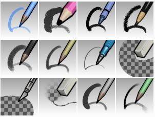
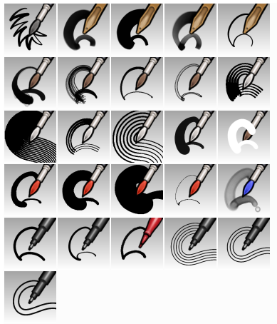
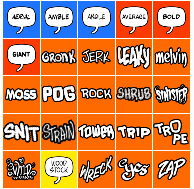
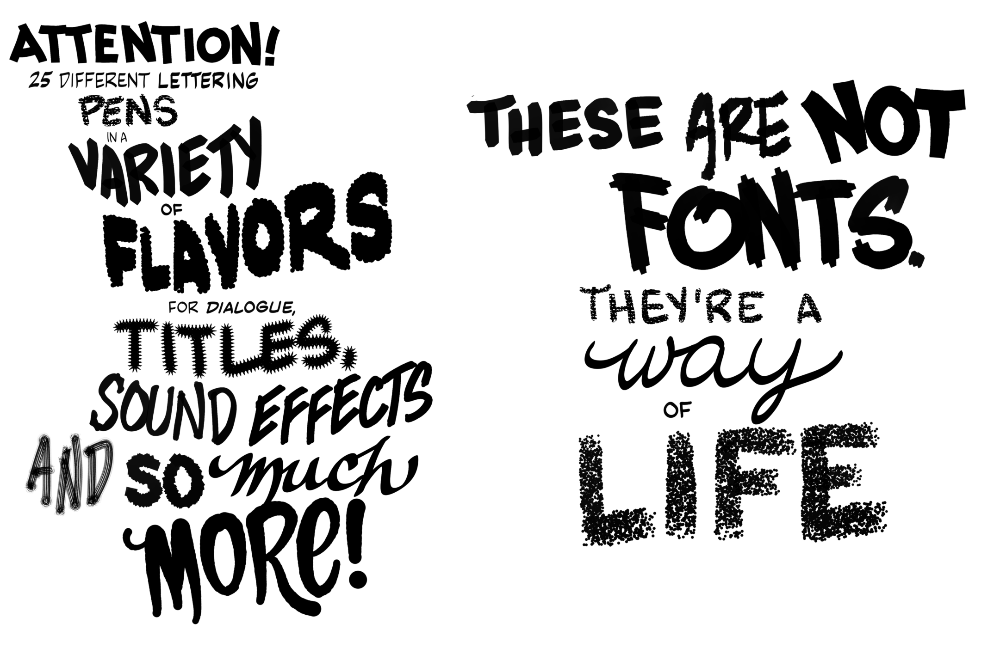
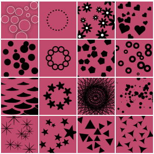
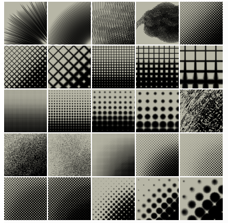
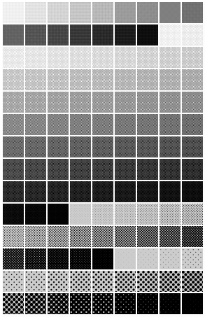
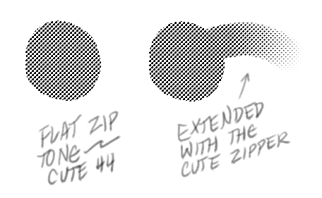
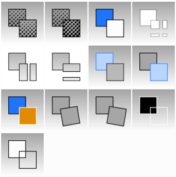
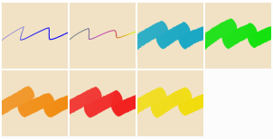

# presets
Brushes and tools for Krita and MyPaint.

## Mojo for MyPaint

A set of brushes for making comics in MyPaint! Download the ZIP and then import it through the brush menu in MyPaint.

## Mojo Moo for Krita 5

Mojo Moo for Krita is huge, basically one giant toolkit split into two ZIP files. Download the ZIP files, then import them through the resources menu in Krita.

### Draw presets

Draw and erase (and cut). In the bottom row, the Oneraser (pronounce it *one-racer*) is handy if set to the eraser end of the stylus, as it allows large and small erasures.

### Ink presets

Many of these brushes are configured to emulate physical brushes, in that they are not simply moving dots, but oval shapes that drag in the direction of your stroke, like the bristles of a sable brush hugging the paper. The brush lines will also display some amount of transparency, and you will sometimes be able to see ink lines crossing each other.

Keep in mind these are not art brushes for paintings that will be displayed large, but brushes for cartoon/comic book linework that will be reduced for print. If you ink digital comics, these should not be used to create comics at their final display size, but larger and then reduced.

### Hand lettering presets

The dialogue presets are color coded blue, red and yellow. The display/effects presets are orange.

Red is the average lettering group. This was created to emulate typical comic book lettering, as you would find in old Marvel comics. Blue is the angled group, which is for more cartoonish lettering.

The lettering presets are mostly straightforward. You'll likely always have to resize them for the job at hand.

The block line presets Trip and Trope, however, are extremely difficult to use. You have to handle the stylus very carefully at line ends to avoid disaster, because when you lift the stylus the line thinks you're about to go in another direction. Zap is offered as an easy alternative, with a line that fakes a block end.

### Stamp presets

Different patterns for quick application.

### Tone presets

You can literally paint with halftone (zipper brushes) and other tone effects.

### Zip presets

These are flat halftone applications that mesh with the zipper brushes.

### Studio presets

Special presets for manipulating your work in a variety of magical ways. It was difficult to come up with icons to represent the actions of each preset, we did our best.

The first two presets are for eliminating anti-aliasing, reducing art to pure bitmap.

There are presets for working with virtual blueline. The blue-to-white preset converts any bright color to white. You can then use white-to-clear to eliminate it altogether. Blue-to-gray and gray-to-blue lets you convert pencils between blueline and gray.

The blue-to-gold preset inverts everything.

The presets with the leaning boxes lets you twist areas of art in one direction or another.

The presets with slices through the boxes are gutter tools. You can use this in conjunction with layer style/stroke to create panel layouts.

### Office presets

For making notations and highlighting areas in work files.

