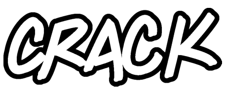
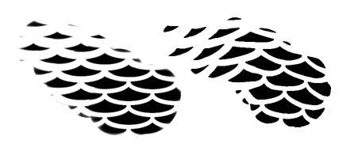
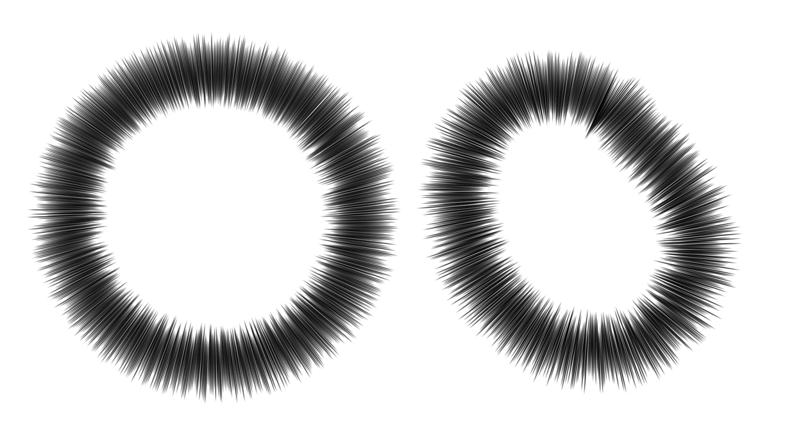
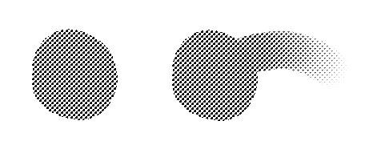

# presets
Brushes and tools for Krita and MyPaint.

* [Mojo for MyPaint](#mojo-for-mypaint) -- Created for MyPaint, can also be used in Krita.
* [Mojo Moo for Krita](#mojo-moo-for-krita) -- For Krita 5.
* [Older sets](#older-sets) -- For Krita 4.

## Mojo for MyPaint

A set of brushes for making comics in MyPaint! Download the ZIP and then import it through the brush menu in MyPaint.

> :warning: This was my first brush set ever, and it seems to have held up well. However, DO NOT step down the size of the Crowquill to hatch. In fact, consider not using Crowquill at all. I find that it's prone to creating ghost lines through the art. **IT MAY DESTROY YOUR WORK.** I apologize for a wonky brush.
>
> Instead, choose the Liner and use *Tool Options* to reduce the size and sharply reduce smoothness. The results can be seen in the hatching in the hair of the following sample.

The hand lettering is a bit sloppy here. MyPaint does not have a grid or guides, but you can create a template and use it as a layer or background image.

## Mojo Moo for Krita

Mojo Moo for Krita is huge, basically one giant toolkit split into two ZIP files. Download the ZIP files, then import them through the resources menu in Krita.

I've been meaning to create a more complete guide to just everything, but the perfect is the enemy of the good. Hopefully this general rundown is enough to get you started. After installing the presets, you can familiarize yourself with the name of each one (as opposed to listing each one in detail here).

### Draw presets

Draw and erase (and cut). In the bottom row, the Oneraser (pronounce it *one-racer*) is handy if set to the eraser end of the stylus, as it allows large and small erasures.

### Ink presets

Many of these brushes are configured to emulate physical brushes, in that they are not simply moving dots, but oval shapes that drag in the direction of your stroke, like the bristles of a sable brush hugging the paper. The brush lines will also display some amount of transparency, and you will sometimes be able to see ink lines crossing each other.

Keep in mind these are not art brushes for paintings that will be displayed large, but brushes for cartoon/comic book linework that will be reduced for print. If you ink digital comics, these should not be used to create comics at their final display size, but larger and then reduced.

### Hand lettering presets

The dialogue presets are color coded blue, red and yellow. The display/effects presets are orange.

Red is the average lettering group. This was created to emulate typical comic book lettering, as you would find in old Marvel comics. Blue is the angled group, which is for more cartoonish lettering.

The lettering presets are mostly straightforward. You'll likely always have to resize them for the job at hand.

The block line presets Trip and Trope, however, are extremely difficult to use. You have to handle the stylus very carefully at line ends to avoid disaster, because when you lift the stylus the line thinks you're about to go in another direction. Zap is offered as an easy alternative, with a line that fakes a block end.

> :bulb: Easy lettering outline: use layer style/stroke.
> 
> 

### Stamp presets

Different patterns for quick application.

> :bulb: Quick effects by applying a stamp pattern, twisting it left and right, then eliminating the fuzz with the bitmap presets (see [studio presets](#studio-presets), below).
> 
> 

### Tone presets

You can literally paint with halftone (zipper brushes) and other tones.

> :bulb: The first two presets, boom and burst, are intended to emulate manga-style thought bursts. You must follow a circular pattern. The ellipse tool will leave one orphan stroke angling the wrong way, so it's better to create an ellipse shape with the assistant tool (left) or if you can manage, freehand (right).
> 
> 

### Zip presets

These are flat halftone applications that mesh with the zipper brushes.

> :bulb: Lay down flat zip tone, then brush outward with the corresponding zipper brush.
> 
> 

> :paperclip: Krita used to have a halftone filter that operated mostly in a decorative fashion, but now it's a professional powerhouse. Instead of these brushes, you could apply flat gray tone to a layer, then convert it to halftone with the filter layer. But then, it might not be bad to have these brushes as an option.

### Studio presets

Special presets for manipulating your work in a variety of magical ways. It was difficult to come up with icons to represent the actions of each preset, we did our best.

The first two presets are for eliminating anti-aliasing, reducing art to pure bitmap.

There are presets for working with virtual blueline. The blue-to-white preset converts any bright color to white. You can then use white-to-clear to eliminate it altogether. Blue-to-gray and gray-to-blue lets you convert pencils between blueline and gray.

The blue-to-gold preset inverts everything.

The presets with the leaning boxes lets you twist areas of art in one direction or another.

The presets with slices through the boxes are gutter tools. You can use this in conjunction with layer style/stroke to create panel layouts.

### Office presets

For making notations and highlighting areas in work files.

## Older sets

More info to come.

